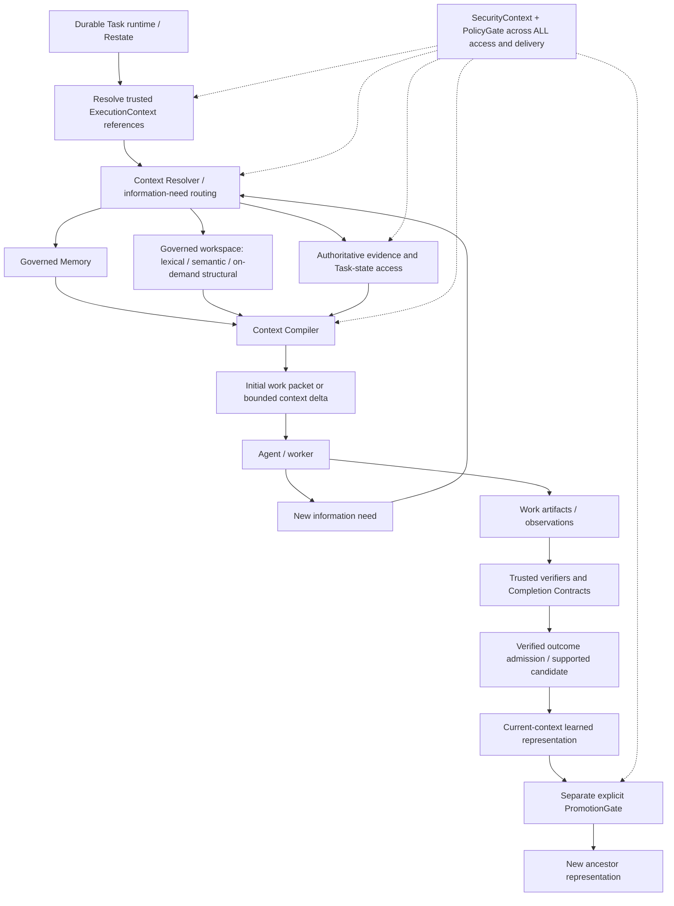

# Track III — Context Plane architecture

**Decision: ACCEPTED ARCHITECTURE. Validation: Partially Validated; CP.1 production slice PASS.**
Consolidated 2026-09-23 from repository baseline `db8b2a4`; this is architecture and
contract consolidation, **not another research increment or production implementation**.
Track III research is COMPLETE. III.8 remains FAIL; III.8R is its separate PASS recovery.
III.10 remains the planned sequence close; III.G is a complementary carveout.

[ADR 0025](decisions/0025-context-plane-and-compiled-agent-context.md) records the decision.
[Context Plane contracts](contracts/context-plane.md) own normative semantic interfaces;
[implementation plan](roadmap/002-context-plane-implementation.md) owns production sequencing:
**CP.1 PASS; CP.2–CP.9 NOT STARTED**. The [CP.1 executable subset](contracts/context-plane-cp1.md)
freezes only its local wire shapes. Later schemas remain implementation gates.
The [main roadmap](roadmap/001-blaine-development-roadmap.md#current-next) owns scheduling
relative to other programs. Historical experiment proposals are not new authorization.

**2026-09-24 production update:** [CP.1](milestones/055-context-plane-cp1.md) implements
one opt-in hosted/local initial projection and one fresh delta through the existing loop
and Goose worker. Native local smoke and deterministic controls pass; live MIRIX remains
unqualified/disabled, and general recovery/concurrency/remote propagation are not claimed.
The architectural discussion and baseline gap inventory below remain the accepted design;
the executable subset/milestone distinguish which gaps this first slice has closed.

## 1. Executive decision

Blaine is a **durable, bounded, evidence-driven execution system that learns from
verified work**. Durable Task/work identity outlives conversations, agents, models,
workers, processes, machines and human delays. Restate owns lifecycle, state, retries,
timers, waits, resume and cancellation. Models make bounded semantic decisions;
workers perform work; PolicyGate owns authority; evidence and deterministic Completion
Contracts determine completion. Neither Memory nor a workspace index establishes truth.

Adopt a Blaine-owned **Context Plane** with two distinct responsibilities:

- **Context Resolver:** determine what permitted information may answer an information
  need; route to the smallest adequate set of governed sources.
- **Context Compiler:** produce the smallest sufficient, faithful and permitted
  representation for the next bounded cognition or worker action.

**The Blaine Context Plane may be broad. Agent context must be compiled and narrow.**
Search broadly, load narrowly. This extends the existing local-first/minimal-packet
policy and mandatory cloud packet architecture to a consistent worker-facing model.
It does not grant workers unrestricted MIRIX, Graphify MCP, vector-store or scope access.

Memory remains continuously resolvable during work; continuous access means additional
bounded requests through Blaine, not permanent injection of all recalled content.
Initial packets and context deltas are projections, not new sources of authority.
Graphify is **ADAPT / ON-DEMAND** behind a structural capability. Workspace novelty and
simplicity remain advice, not a deterministic prohibition on creating abstractions.

## 2. Problem and provenance of this decision

Local context can hide a useful existing abstraction; dumping the whole repository
creates noise, expense and disclosure risk. Historical memory can help later work,
but can also carry false success, private provenance or stale advice. Durable work
cannot depend on an in-memory context object or a worker's session surviving.

The [earlier Spotify-inspired context design](agentic-development-kit.md#6-context-engineering)
asks what the worker needs **right now** and makes relevant relationships addressable.
We adopt that principle, not a Spotify product or an assertion about Spotify's current
implementation. Blaine does context engineering for workers, including local workers.
Workers should begin useful work from a prepared projection rather than reconstruct
all project context. Additional authorized workspace tools remain possible for actual
work; having such a tool is not ambient access to the knowledge backends.

Evidence labels in this consolidation:

| Label | Meaning |
| --- | --- |
| Demonstrated | Retained experiment result within its stated fixtures and controls. |
| Inferred | Architectural interpretation; not a new measurement. |
| Decided | Normative production direction accepted here; not yet implementation. |
| Open | Production mechanism or quality question not settled by research. |

## 3. Evidence and what it does not prove

Each row links its experiment, source fixtures and machine-readable results. The
[III.1 research report](research/track-iii/001-reference-systems.md) retains upstream
source pins and distinguishes documentation, inspected behavior and benchmark claims.
No upstream self-reported benchmark is used as Blaine acceptance evidence.

| Evidence | Demonstrated result | Production limitation |
| --- | --- | --- |
| [III.1 PASS](../experiments/track-iii-001/README.md) | Mechanisms separable from external runtimes. | Source research, not deployment or security proof. |
| [III.2 PASS](../experiments/track-iii-002/README.md) | Generic tree, local writes, permitted ancestor reads, malformed-tree rejection and caught sibling leak. | Finite trusted fixture, not authentication or persistence. |
| [III.3 PASS](../experiments/track-iii-003/README.md) | Later participants see new permitted observations; trusted human origin; distinct empty/denied/unavailable states. | No production storage/continuous retrieval integration. |
| [III.4 PASS](../experiments/track-iii-004/README.md) | Domain/policy intersection, raw/derived/graph/cache/metadata isolation; ID and activity side-channel controls. | Synthetic representations and trusted labels; no general DLP. |
| [III.5 PASS](../experiments/track-iii-005/README.md) | Explicit immediate-parent admission, private audit/public receipt, fail-closed scanners and replay checks. | Hand-authored abstraction; not semantic declassification or production approval. |
| [III.6 PASS](../experiments/track-iii-006/README.md) | Evidence-qualified success/failure; incomplete/contradictory cases cannot become success. | Exact candidate-support pairs; no arbitrary-language entailment. |
| [III.7 PASS](../experiments/track-iii-007/README.md) | Two paired local-model runs: matching 0/4→4/4; irrelevant/traps 4/4→4/4; failure-as-success corruption harms decisions. | Synthetic historical-information ablation, hand-authored knowledge, not universal learning. |
| [III.8 FAIL](../experiments/track-iii-008/README.md) | +1 non-lexical target, below +2; broad candidates omitted by 2 KiB selection; stale fusion suppresses fresh lexical hits. | FAIL preserved; safety success did not establish utility. |
| [III.8R PASS](../experiments/track-iii-008r/README.md) | Same corpus: +3 targets per revision, exact hits retained, fresh fallback restored, maximum 2047 bytes. | Known-corpus recovery; parameter/diversity causality not isolated. Structural gain remained unproven there. |
| [III.9 PASS](../experiments/track-iii-009/README.md) | Two paired runs: duplicate introductions 4/4→0/4; legitimate and near-match correctness 4/4→4/4; corrupted contract excerpt causes false reuse. | Advisory decision fixture, not implemented code quality or hard-gate evidence. |
| [III.10 PASS](../experiments/track-iii-010/README.md) | Twelve handoff/resume/real-process cases; current policy/topology and trusted provenance win over serialized claims. | Atomic trusted fixtures, not Restate integration, remote identity or concurrency. |
| [III.G PASS](../experiments/track-iii-graphify/README.md) | Real Graphify +8 unique targets, combined +9; eight exploration-request reductions; no stale/forbidden output; maximum 1995 bytes. | Stronger on Jackson; slower local graph queries, ambiguous overloads, incomplete calls, full cached rebuild. Optional isolation mutation inconclusive. |

III.7's experimental provenance extension deliberately made III.6 qualified memories
compatible with III.5 promotion without changing status/security. Production must
version compatible semantics explicitly; it must not coerce new statuses to old ones.

The architectural inference is that scoped retrieval and compilation are useful,
separable capabilities. The production decision is to enforce their contracts across
existing seams. General sufficiency, generated reflection quality, production storage,
concurrency and distributed enforcement remain open. Research COMPLETE is not a claim
that every hypothesis passed or the production Context Plane exists.

## 4. Accepted ownership and information flow

The diagram does not make promotion mandatory for learning. Admitted knowledge may
stay local indefinitely. Declaration and unverified observation have separate authorized
write paths. Completion is the existing runtime application of the Completion Contract,
not a state transition owned by the reflection layer. These are responsibilities and
interfaces, not a requirement for separately deployed services or another orchestrator.

## 5. Generic hierarchical knowledge context

A **ContextNode** is the single bounded knowledge primitive. Initially one tree: root
has no parent, every other node exactly one. Unique scoped identity, no cycles/missing
parents/multiple parents. Validate relevant topology as a structure independently of
content permissions; an inaccessible branch cannot hide structural corruption.

Kinds such as project, epic, card, task, work, attempt, experiment and initiative are
labels. There is no TaskMemory/CardMemory/ProjectMemory engine or label-dependent rule.
Knowledge lineage is not automatically the execution/child-Task tree or workspace
filesystem hierarchy; trusted binding explicitly associates existing Task/work identity.

For bound C: read C plus permitted ancestors; ordinary observation write targets C.
No implicit descendants, siblings, cousins or unrelated context visibility. Root is not
an aggregate descendant query. Inheritance downward is automatic within permission;
promotion upward is governed. Initially promotion is immediate-parent only; reaching
higher ancestors requires separately admitted steps, preserving III.5's tested boundary.
A future skip-level policy would need a separately reviewed contract extension.

Hierarchy validity and mutable-policy invalidation require revisioned trusted state,
not a caller-supplied ancestor list. Topology mutation administration is later work;
first slice supports a validated deployment-owned immutable snapshot, not user reparenting.

## 6. SecurityContext and metadata

Effective readable knowledge is **structural lineage ∩ SecurityContext visibility ∩
policy**, then any independently applicable source/resource permission. Security domain
is not determined by tree shape or a kind string. A shared root grants no implicit
cross-domain bridge; explicitly shared entries can be readable from both domains.

For workspace resources and evidence, apply the context binding plus their actual
resource grants. A workspace-wide search within an authorized project is not permission
to read every child Task's Memory. A parent's explicitly admitted child TaskResult remains
available under the existing result/evidence contract; that is not an implicit read of
child Memory, and does not persist parent learned knowledge without promotion.

Security covers raw text, IDs, paths, excerpts, summaries, embeddings, indexes, graph
nodes/edges, cached packets, provenance, diagnostics, counts and revisions. Multi-source
derivations require permission to every protected source unless a distinct approved
declassification produced a separately classified representation. Retrieval relevance,
verified outcome, human provenance and graph connectivity cannot widen authority.

Providers must partition/filter before search statistics, external processing, embedding,
traversal or any untrusted exposure. Compiler checks are defense in depth, not permission
to globally retrieve secrets and filter at the last moment. Indexes spanning domains
inside a trusted boundary still require scoped query/diagnostic behavior; a shared
backend must demonstrate this before use. Secrets never become reusable memory or
embedding inputs; credential-provider references remain subject to ADR 0023.

Use destination/visibility-scoped external identities and collision behavior. Hidden-ID
and missing-ID probes must not disclose protected existence. Do not expose global
activity counters, invalidation generations or raw content hashes as cross-domain
oracles. Freshness markers must describe only permitted state. Private policy versions,
source provenance and audit details need not appear in caller packets.

## 7. ExecutionContext and trusted binding

Use existing `ExecutionIdentity` Task/run/dispatch/operation IDs rather than new parallel
execution identities. An **ExecutionContext reference** associates those identities with
knowledge context, security/authority and evidence provenance references. It is small,
versioned reference data, not a bag of mutable snapshots or worker-chosen capabilities.

Trusted runtime integration resolves it against current Task/work route, principal,
context topology, policy and resource grants. The worker can describe a need and name
an untrusted locator; it cannot select its security domain, ancestors, promotion role
or memory provenance. Copied reference bytes, trace IDs and supplied revision strings
confer no authority. Neither a ContextNode nor a Memory store owns Task lifecycle.

Current [ExecutionIdentity](contracts/worker-execution-boundary.md#normalized-execution-identity)
is correlation, not this authorization resolver. TaskState.context_ref currently names
a retained CognitiveTurn artifact; do not silently reinterpret it as a ContextNode ID.
Public TaskSpec.context describes needs, while the narrower executable TaskSpec does
not yet accept that field. Any supported extension must be explicitly versioned at
its binding; do not pass unknown fields through existing validators.

## 8. Memory Plane and trusted provenance

Memory answers what was declared, observed or learned from prior work. It remains
fallible operational knowledge, continuously available through governed resolution.
New observations can be retrieved by later participants without carrying the prior
packet. There is no requirement for constant polling, a giant initial prompt or direct
worker access to storage.

Separate provenance dimensions rather than freeze one overloaded product enum:

| Semantic class | Trusted issuer and qualification | What it does not establish |
| --- | --- | --- |
| USER_DECLARATION | Authenticated/authorized human declaration path; explicit destination grant. | Verified execution, public visibility or extra capabilities. |
| AGENT_OBSERVATION / UNVERIFIED | Runtime-bound participant records an observation in current C. | Success, failure proof or promotion. |
| Verified-success-derived | Trusted current outcome/evidence plus supported candidate; retain success qualification. | Arbitrary causal/generalized truth or future Task success. |
| Verified-failure-derived | Trusted failure evidence plus supported failure candidate; retain failure qualification. | Successful guidance or a recommended procedure. |

Origin, epistemic status, source/evidence references and security classification are
orthogonal. Storage and every renderer preserve them. Unknown versions/statuses fail
closed for admission rather than being mapped to a stronger old value. Private evidence
references remain private; ordinary retrieval exposes a safe provenance projection.

Human declaration is an authorized direct write, not child-to-parent promotion.
Retrieving a preference does not alter accepted Task constraints or PolicyGate. Conflict,
supersession and preference precedence are not invented here: expose relevant conflict,
retain source qualification and resolve through authorized Task/human channels.

## 9. Verified outcome admission and reflection

Worker claim ≠ authoritative outcome ≠ reflection candidate. Verification determines
whether an experience may teach Blaine; reflection determines what it might teach.
All required current evidence is necessary for verified success. Missing, unavailable,
unknown, contradictory or unrun requirements cannot be interpreted as PASS. A Task's
FAILED lifecycle alone is also insufficient to prove a particular failure mechanism.

Verified failure can support a useful failure-qualified candidate; unfinished work can
retain useful unverified observations. Outcome qualification does not establish arbitrary
natural-language entailment. Initial learning integration must restrict admission to
explicitly supported statement forms or a reviewed support decision, not automatically
verify every sentence a reflection model writes. LLM reflection and consolidation are
later/unproven, not conditions of this first production slice.

Admit into the current context, linking trusted immutable evidence internally. Do not
copy raw logs, source files or protected verifier details into ordinary Memory retrieval.
A replayed admission checks current requirements/evidence; a receipt is evidence of a
past decision. Historical learned entries are not automatically revoked by a later
failure, nor do they override current evidence. Correction/retention policy remains open.

## 10. Promotion and declassification

Promotion is the only normal upward movement of persisted knowledge. It is separate
from observation writes, direct human declarations, reflection admission and existing
authoritative child-result delivery. The request binds source, candidate, immediate
parent destination and trusted authority; the gate validates the permitted route and
preserves origin/status. Source stays unchanged; destination gets a distinct record.

Same-domain admission still needs authority and applicable admissibility policy. An
agent creating an entry does not acquire promotion rights. Cross-domain admission also
requires explicitly authorized declassification of the exact candidate, approved source/
destination relation and all required checks. Generation and admission are separate:
a model may propose an abstraction but cannot certify it as declassified.

Unavailable/crashed/malformed/unknown required checks deny admission. Synthetic literal
scanners demonstrated gate composition, not complete DLP or removal of confidential
meaning. Production cross-domain promotion stays disabled until its approval and checking
policy is validated. Clean scans alone are insufficient. Pseudonymization, safe-looking
wording or USER_DECLARATION origin is not permission.

Keep private audit and destination-visible receipts separate. Source IDs, scanner matches,
private creators, repository URLs and source hashes do not automatically cross with a
sanitized candidate. Idempotency is scoped; current admission requirements are checked
before replay returns historical success. No double write or silent status upgrade.

## 11. Workspace knowledge and routing

Workspace knowledge answers what exists **now**. Git/files/current source bytes are
authoritative; lexical/semantic/structural views are derived. A commit alone does not
prove a dirty worktree's current content. Bind workspace identity, revision/digests,
source extent and extractor/index version; revalidate assertions at consumption and
consequential action. Stale/unknown indexes abstain or trigger authorized fresh fallback.

The Resolver routes by need, not by always running every provider:

| Information need | Default source route | Escalation / limit |
| --- | --- | --- |
| Exact symbol, literal, signature or configuration | Lexical/source read | Cheapest adequate default; preserve exact excerpts. |
| Concept without known canonical identifier | Semantic workspace search | Existing local BGE-M3 candidate; validate hits against source. |
| Implements, callers, dependency neighborhood, bounded path | Structural, on demand | Graphify adapter; typed relations, bounded traversal, source validation. |
| Historical success/failure or declared knowledge | Memory | Preserve scope, uncertainty and success/failure qualification. |
| What happened, did criteria pass, current Task state | Evidence/runtime | Never substitute Memory or graph for the authoritative owner. |
| Mixed/ambiguous need | Bounded routing decision, then justified combination | No unrestricted recursive exploration or automatic fan-out. |

Deterministic intent rules should cover simple cases; bounded local semantic routing
is a later replaceable aid where ambiguity warrants it. Worker purpose/source hints
are not backend choices or grants. Route quality, cost and fallback must be evaluated;
no router may silently broaden scope or bypass budget. Long preparation can become
existing durable Work/Task when warranted, not a new context scheduler.

## 12. Graphify and semantic implementation decisions

**Graphify: ADAPT / ON-DEMAND, external implementation behind Blaine contract.**
III.G used v0.9.64 at `b9cd9570728a5ff3485d2a1e36fe9a1272a368ae` on Spring
`fff33914d4e450a33e17195e11a79937c3505605` and Jackson
`c59ce26302bb9cfdc8084ffee1e1318ad1db3d99`. Combined gains were +1 Spring/+8 Jackson.
Eight queries required fewer exploration requests; local graph query times were higher.
Native initial extraction+build was 1.786/4.301 seconds; cached full rebuild 1.233/2.876
seconds. These are small tested repositories, not production performance guarantees.

The future boundary is `workspace.structure.query/neighbors/path`, not raw Graphify MCP.
Retain EXTRACTED/INFERRED where useful, validate both. Overload misattribution and missing
call chains require precise source identities and abstention. Graph connectivity is not
runtime impact or semantic equivalence. Incremental graph maintenance was not proven.
III.G's combined S-I1 packet fit fewer targets than Graphify alone because provenance
consumed bytes: more sources are not automatically better. Routing precedes fusion.

**Semantic: replaceable capability, existing local BAAI/bge-m3 first candidate.**
III.8R and III.9 support useful conceptual discovery through the existing embedding path;
not optimal embeddings or universal relevance. Model/version/dimension, chunking and
index/source identity must match. Use current infrastructure when a later slice is
justified. Claude Context remains a reference, not a required dependency. No Milvus,
new persistent vector service or training is authorized by consolidation.

## 13. Context Resolver

Input: trusted binding plus bounded information need, intended next operation and
runtime-approved budgets/freshness requirements. Output: internal candidate contributions
with authoritative locators, derivation/provenance, supported scope and uncertainty.
It is not a worker-facing dump and not a new source of policy authority.

Resolve current access first, then select permitted capabilities. Providers enforce
access before retrieval; preserve each contribution's independent freshness/security
until compilation. Track required versus optional sources. An optional unavailable
semantic index may allow fresh lexical fallback; unavailable authority cannot. Distinguish
empty, denied, unavailable, stale and unsupported rather than representing all as no hits.

Task state and Evidence remain owned by their existing interfaces. A resolver may use
Memory to locate a possible prior result, but must query authoritative evidence to state
what occurred. Provider suggestions are untrusted context, never executable instructions.

## 14. Context Compiler

Compile selected internal candidates into one action-specific projection:

1. Revalidate trusted access, freshness and authoritative source support **before
   competition**. Remove invalid contributions, not independently valid alternatives.
2. Canonicalize authoritative targets by workspace/source identity and version/extent;
   deduplicate payload while retaining permitted provenance. A stale semantic edge cannot
   poison an independently fresh lexical hit for the same target.
3. Rank within comparable result classes; use heterogeneous rank fusion when combining
   incompatible scores. Preserve high-confidence exact evidence and mandatory contract
   material before discretionary context. III.8R's RRF k=60 is an experimental parameter,
   not a permanent protocol constant or requirement to fuse every source.
4. Apply diversity and select for the information need. Source-family normalization is
   a heuristic, not proof that code contracts match. Do not collapse differing status,
   security, revisions, conditions or contradictory sources as redundant.
5. Preserve exact evidence; condense only eligible material. Include uncertainty and
   safe provenance; compute the full serialized output budget and a final leakage check.
6. If required evidence cannot fit, return an explicit insufficiency/partial outcome;
   narrow the action or request authorized budget adjustment. Never silently remove a
   mandatory criterion, material contract distinction or failing assertion to fit.

Compiler uses PolicyGate decisions; it cannot create grants. A summary remains derived
and does not upgrade provenance. Model-assisted synthesis is optional, locally governed,
fallible and replaceable; first slice uses deterministic selection/rendering only.

## 15. Initial packet, exact evidence and deltas

An **initial Task/Work packet** contains what is needed to begin the next bounded work:
objective, constraints, relevant architecture and memory, selected current source,
exact important excerpts, authoritative evidence references and completion requirements.
It is rebuilt for the intended action/recipient rather than copied from the parent
transcript. Authority summaries are informational; enforcing code holds actual grants.

A **context delta** answers a new information need such as a transitive dependency
question. It binds the current operation and compatible base packet, retains fresh
source/status, and says what it adds or supersedes. A delta is not an append-forever
transcript. At the next boundary recompile a bounded active projection, retaining old
packets as appropriately protected historical artifacts, not automatically re-injecting
them. New workers receive freshly compiled packets; they need not read every old delta.

| Preserve exact when material | Condense when safe and useful |
| --- | --- |
| Method signatures; failing assertions; API/Completion Contract requirements; SQL fragments; error messages; exact code; authoritative IDs/refs | Exploration history; large tool outputs; graph neighborhoods; episodic descriptions; architecture explanation; prior reasoning history |

Safe synthesis plus exact excerpts plus references can coexist. Excerpts identify
source/range/version and mark omissions; they must not claim an omitted condition does
not exist. Truncating a code comment into a false contract is a quality/security failure.
III.9's mutation establishes that presentation fidelity matters after successful retrieval.
Private reasoning transcripts are neither required evidence nor a default packet section.

## 16. Budget and sufficiency

Every packet/delta has an explicit approved byte budget, with model/token and tool-call/
latency limits where applicable. Budget includes content, metadata, diagnostics and
truncation markers. Effective budget is the narrowest applicable recipient/dispatch
constraint. The experimental **2 KiB** limit is not a universal production constant;
workload/action needs and exact evidence can justify separately authorized larger bounds.
Existing smaller adapter bounds are not increased by this document.

Objective: minimize delivered context **subject to required evidence and Task quality**.
Context Amplification Ratio (material considered / material delivered, consistent units)
can describe a run, with cache/counting conventions disclosed. It is not an optimization
target by itself; maximizing it can hide cost or remove useful evidence. Record quality,
misses, harmful advice, cost, latency and budget sufficiency separately.

## 17. Durable propagation and replay

**Serialized context is a reference, never a grant.** Transfer/checkpoint data can retain
execution/context/correlation references and historical revision metadata. It cannot
freeze readable scopes, policy, topology, provenance or declassification authority.
Receiving runtime resolves current trusted state. Current policy and topology win;
Memory is re-queried; unknown/malformed/unavailable authority fails closed.

Respect Restate replay: committed context/model/operation results stay immutable historical
observations and are not recomputed merely to replay a journal. Consuming an old journal
record does not itself authorize a **new physical** model/worker delivery, source read or
effect. At those boundaries revalidate current authority and source requirements. If a
prior packet is no longer permitted, refuse fresh delivery and use a newly admitted
resolution/continuation, never rewrite the historical journal slot or silently change
bytes bound to an existing frontier grant. Physical retries need this check too.

The [existing continuation admission contract](contracts/worker-execution-boundary.md#durability-rules)
replays past decisions; that historical decision remains historical. New Context Plane
access enforcement is a distinct obligation, not a change to replaying old decisions.
Do not use telemetry callbacks as enforcement. Complete Restate recovery integration
requires its own implementation phase and fault tests; III.10 did not provide it.

Trace/correlation propagation supplies observability, not permission. Remote pairing,
transport authentication and local workstation consent remain in ADR 0022/Hub ownership.
Do not create a competing cross-host identity system. Snapshot atomicity, concurrent
revocation and validation-to-action races are explicit unresolved production gates.

## 18. Novelty and simplicity

Novelty asks whether an existing abstraction satisfies the intended contract. Simplicity
asks whether another abstraction/generalization is justified at all. Compiler may provide
current candidates, exact material contract facts, differences and short generic advice.
Neither semantic similarity nor source-family grouping establishes equivalence.

III.9 supports advisory value, not a hard NoveltyGate/SimplicityCritic, universal design
quality or a separate causal benefit from its wording. Current Task contract/evidence
can override similarity. A legitimate new abstraction remains a permissible decision.
Hard blocking on similarity is **REJECTED** for the accepted architecture.

## 19. Mechanism and component disposition

Statuses are semantic direction, implementation scheduling or provider placement; they
are not claims of deployment. Multiple labels distinguish an accepted capability from
an unimplemented adapter. Product adoption is distinct from mechanism adoption.

| Mechanism/component | Classification | Decision and limits |
| --- | --- | --- |
| Generic ContextNode; trusted binding; SecurityContext | ACCEPTED ARCHITECTURE; FIRST-SLICE IMPLEMENTATION subset | One tree, scoped reads/writes, references not grants. Dynamic administration later. |
| Resolver and Compiler; initial packets/deltas | ACCEPTED ARCHITECTURE; FIRST-SLICE IMPLEMENTATION subset | Separate routing from faithful bounded projection; no mandatory separate services. |
| Continuous Memory facade | ACCEPTED ARCHITECTURE; FIRST-SLICE IMPLEMENTATION read subset | Governed search/retrieve now planned; no raw worker storage API. |
| MIRIX | EXTERNAL IMPLEMENTATION BEHIND BLAINE CONTRACT | Current optional retrieval substrate/candidate persistence backend; Blaine owns semantics. Scope metadata/filter tags alone are insufficient authority. |
| Lexical/source discovery | FIRST-SLICE IMPLEMENTATION | Cheap default on explicitly admitted local workspace/evidence; no new search service. |
| BGE-M3 semantic search | EXTERNAL IMPLEMENTATION BEHIND BLAINE CONTRACT; LATER IMPLEMENTATION | Reuse existing local infrastructure behind generic workspace semantic search when needed. |
| Graphify structural search | ON-DEMAND CAPABILITY; EXTERNAL IMPLEMENTATION BEHIND BLAINE CONTRACT | ADAPT / ON-DEMAND; later adapter with source validation and workload routing. |
| Declared/observed writes | ACCEPTED ARCHITECTURE; LATER IMPLEMENTATION | Trusted provenance and durable readback/idempotency before claiming committed writes. |
| Verified outcome admission; PromotionGate | ACCEPTED ARCHITECTURE; LATER IMPLEMENTATION | Separate qualification, support and upward admission. No silent status upgrade. |
| Automatic reflection/consolidation, utility/voting/decay | EXPERIMENTAL / UNPROVEN | Do not equate recall, model votes or worker finish with verified helpfulness. |
| Atomic memory lifecycle ideas | LATER IMPLEMENTATION / EXPERIMENTAL as above | Adapt bounded recall, staged reflection, lessons/procedures concepts. Do not adopt its agent runtime, SQLite design, timer scheduler or turn-finished success signal. |
| agent-skills concepts | ACCEPTED ARCHITECTURE practice | Adopt/adapt progressive disclosure and separate structural/routing/behavioral evaluation; no whole catalog or implicit permissions. |
| Ponytail concepts / novelty-simplicity | ACCEPTED ARCHITECTURE advisory; LATER IMPLEMENTATION | Adapt anti-duplication and justified-scope advice; not persona, LOC minimization or hard reuse rules. |
| Claude Context | EXPERIMENTAL / UNPROVEN product adoption | Reference design; no required dependency or Milvus service. |
| OmniRoute | EXPERIMENTAL / UNPROVEN provider candidate | Observe/adapt plumbing only. Never owns cognitive/resource allocation or authority; no adoption here. |
| Unrestricted raw knowledge tools, graph/memory as truth, automatic upward writes | REJECTED | Violates authority, evidence and bounded-consumption boundaries. |

## 20. Existing integration seams and gaps

| Current repository seam | Preserve | Smallest compatible evolution / gap |
| --- | --- | --- |
| `runtime/kernel/context.py`: ContextProvider and reconstruct | Supplemental authority=derived; authoritative spec, human resolutions, evidence and observations remain distinct. | Resolver/Compiler can feed bounded derived ContextItems; current request has Task/objective/specialist/budget, not secure lineage. Bind server-side, not from provider payload. |
| `runtime/kernel/contracts.py`: CognitiveTurn/TaskState | Current Task/turn identity, completion criteria, capability limits and versioned envelopes. | Do not conflate context_ref with ContextNode. Explicit versioned extensions only at the selected boundary. |
| `runtime/kernel/worker.py` / execution.py: WorkerInput, worker.run | Existing local one-shot Goose seam, admitted artifact refs and verification. | Current WorkerInput is caller-authored bounded data, not proof of compilation. Require compiler-issued packet admission on the opted-in path; provenance survives rendering. No fake mid-call callback support. |
| `runtime/kernel/memory.py`: MirixContext | Optional bounded loopback semantic read returning derived items. | No writes or lineage enforcement today; row source/filter_tags are not trusted provenance/ACLs. Require trusted entry metadata, confined backend access and receipt readback before widening scope. Current audit can retain full raw responses: not safe cross-domain observability. |
| `runtime/kernel/project_knowledge.py` | Optional bounded source-digest-checked navigation; derived authority. | Not default runtime wiring or III.G structural adapter. It lacks a complete security-aware relation contract; do not promote its existence into adoption. |
| ArtifactStore, evaluate, CompletionEvaluation | Exact immutable Task-scoped artifacts; criterion satisfaction/unknown; independent human verification. | Learned status is separate from ContextItem authority and lifecycle. Cross-Task evidence requires existing authorized admission, not generic bypass reads. |
| PolicyGate + Capabilities | Existing operation admission, scopes and effect ownership. | Future bounded context request must be admitted here; Compiler is an enforcer, not a competing authority. |
| FrontierContextProjector / ProjectedContext | Exact bytes/digest, trusted factory, independent accepted grant and dispatch checks. | A compiled packet is input to required cloud projection/egress, not a replacement grant. IdentityProjector is not DLP or a context compiler. Every cloud delta repeats the same boundary. |
| ExecutionIdentity / ContinuationBoundary | Existing Task/run/dispatch/operation correlation and honest adapter support. | Add knowledge/security reference resolution, not another lifecycle/identity hierarchy. |
| Hub/ACP workspace and remote execution | Task/workspace/registration grants, local consent, current route and evidence. | Context propagation later composes with these; no host scan of a remote workspace or new transport assumption. |

Current kernel caps include 4096 content bytes and 16384 CognitiveTurn bytes; WorkerInput
currently allows at most four source/content entries, 4096 total bytes and 2048 characters
per content field. These are existing validation facts, not universal Context Plane
budgets. The first slice must fit and check actual encoding at every envelope boundary.

## 21. Production contracts and first slice

The [normative contract](contracts/context-plane.md) defines Memory, workspace, evidence,
resolve/compile, promotion and learning interfaces without committing to provider APIs or
final enums. The [plan](roadmap/002-context-plane-implementation.md) makes their dependencies,
acceptance tests and stop conditions concrete.

**Recommended next increment: CP.1 — Local governed context projection and one delta.**
One local existing worker.run path, a generic trusted context binding, read-only Memory
facade, explicitly authorized lexical/exact evidence, deterministic Resolver/Compiler,
initial compiled WorkerInput and one information-need request from the owned loop.
A second fresh worker dispatch can consume the delta; the current one-shot worker is
not falsely advertised as a tool-capable continuing session. No new memory backend,
remote route, production learning, promotion or all-provider fan-out is needed.

The plan uses an explicitly registered local corpus and trusted entry metadata for the
bounded slice. It does not declare current MIRIX search filters production isolation.
Missing provider scope/provenance support returns unavailable/denied, not legacy broad
retrieval. Write ingestion, dynamic context administration and durable cross-domain
storage adoption are separate increments. Rollout is opt-in; no hidden fallback bypass.

## 22. Failure modes and observability

| Failure mode | Required prevention |
| --- | --- |
| RAG everywhere / worker-owned backends | Workers request needs; runtime binds authority and routes capabilities. |
| Prompt dumping / unbounded delta accumulation | Compiler delivers one budgeted active projection with safe references, not concatenated search results. |
| Authority by serialization | Resolve trusted current state at access/delivery; historical packet/receipt is not a grant. |
| Memory as truth / worker success as evidence | Preserve semantic status and consult exact current evidence/Completion Contract. |
| Graph as truth | Validate source/symbol/typed relationship; unknown/ambiguous abstains. |
| Similarity as equivalence | Preserve material distinctions; advisory only, current contract primary. |
| Upward contamination | Observation targets current C; separate explicit parent promotion. |
| Cross-domain derived/metadata leak | Permission intersection before source processing and before emission; scoped IDs/counts/revisions/audit. |
| Infrastructure proliferation | Reuse existing stores/inference; new service needs measured justification and separate approval. |
| External product ownership | Adapters implement Blaine contracts; products do not own state, authority, learning qualification or completion. |
| Freshness or budget mistaken for no result | Distinct unavailable/stale/partial/insufficient states; never claim exhaustive absence from partial discovery. |

Use existing ExecutionEvent/Recorder seams: scoped operation/correlation, routing choice,
provider/version, validation status, budget used, safe truncation reason, latency and
quality outcomes. Count stale/denied candidates only in appropriately restricted audit;
public metrics must not reveal protected object counts/activity. Content capture is off
by default. Raw queries, code, vectors, scanner matches and full backend responses are
not ordinary telemetry. Telemetry failure cannot grant access or change completion;
a required enforcement/audit-commit failure must stop its operation according to policy.

Record surfaced/used/verified-helpful/harmful/unknown separately when later utility
measurement exists. Track final packet coverage and material distinction fidelity, not
just candidate recall, compression ratio or model praise. Record initial compilation
versus delta cost and fresh fallback; no opaque single context score.

## 23. Remaining decisions, non-goals and retained ADRs

Open production questions: trusted entry/context metadata persistence and issuer; atomic
policy/topology snapshots and action-time validation; idempotent MIRIX write/readback;
correction/retention and derived-cache revocation; multi-source contradictory knowledge;
candidate semantic support; budgets by workload; whether real worker quality offsets
retrieval cost; Java overload precision and incremental graph maintenance; cross-host
identity/consent and revocation latency. These are scoped gates in the implementation
plan, not reasons to leave basic invariants vague. CP.1 deliberately limits mutable and
multi-host state rather than claiming these problems solved.

This session adds no runtime classes, API handlers, dependencies, schema migrations,
services, model calls, automatic reflection, promotion implementation, embeddings,
Graphify runtime integration, Restate behavior, remote execution or credential systems.
No first production increment is started. Authorization to consolidate is not deployment
or integration authorization.

Retain ADRs 0001, 0003, 0008, 0009, 0012, 0015, 0016 and the constrained platform/Hub/
secret boundaries. This decision generalizes compiled context to local workers without
weakening the mandatory cloud packet/egress path. ADRs 0013 and 0014 remain historically
Proposed: this ADR accepts the narrow retrieval-first and fail-closed egress principles
needed here, **not** their entire transformation/training taxonomy or unvalidated
implementation. No accepted ADR is superseded. Historical context/catalog aspirations
are refined by this specification, not rewritten as completed implementations.

Consolidation PASS means a coherent documented architecture and bounded plan, not
production validation. No conflict with existing owners requires a human resolution.
Human authorization is required to start CP.1; later choices listed above require
separate review when their phase is selected. Track III research can now be marked
COMPLETE while production Context Plane implementation remains NOT STARTED.
