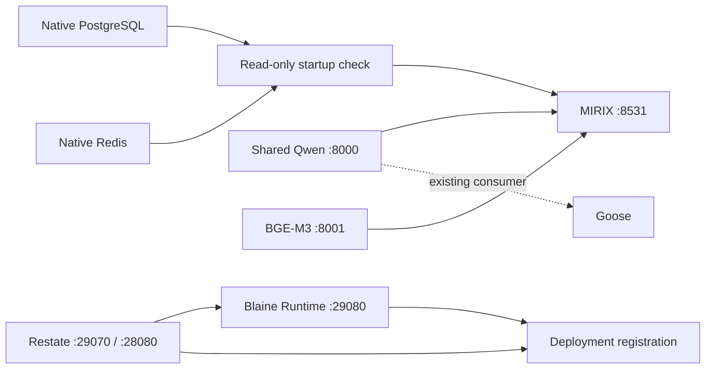

## Executive answer

**INFERRED: devenv fits the topology, but Process Compose is the smaller next
step for Blaine's current process-plumbing problem.** Both can supervise existing
executables; neither needs to own native PostgreSQL/Redis, Python environments,
NVIDIA drivers or durable Tasks. SecretSpec is usable independently of Nix.
Keeping those dependencies external limits devenv's immediate reproducibility
benefit. Do not redesign Blaine or remove all of `scripts/dev.py`.

One [static devenv prototype][prototype] was produced. No installation, service
start, secret read/write, host change or integration was performed.

## Evidence

**OBSERVED — repository:** `scripts/dev.py` implements PID/start-time ownership,
flock, spawn, signals/timeouts, logs, readiness polling, port checks, deployment
registration and status/doctor output. The shell entry points delegate to it.
`setup.sh` delegates to `setup-runtime.sh`, which provisions local uv/Python and
Restate binaries. Five additional relevant Blaine files were read; scope and
probe accounting are recorded in the [README][prototype].

**OBSERVED — host:** Nix/devenv/Process Compose/SecretSpec were absent in checked
locations. Official `bws 2.1.0`, local Restate/runtime executables, and the
requested vLLM/MIRIX environments exist. PostgreSQL accepted connections and
Redis answered PONG. Application HTTP endpoints did not connect during the
read-only snapshot; no services were started. [Inventory][host]

**OBSERVED — official documentation:** current devenv uses a native process
manager, with process/task dependencies, exec/HTTP readiness, restart limits,
graceful shutdown and subset startup. Process Compose is an alternative backend,
not a prerequisite for current devenv. These capabilities are documented,
**UNVERIFIED on this host**. [devenv processes][processes]

**OBSERVED — interface:** current CLI source exposes `processes list`,
`status NAME`, `logs NAME`, `start/stop/restart NAME`; `up`, `down` and
`processes attach` cover normal development. Use those interfaces directly.
Logs/status refer to processes, not verified Task completion. [CLI][cli]

**UNVERIFIED:** Nix evaluation, process handoff, GPU ABI/library environment,
actual SecretSpec/BWS resolution and bundled provider features. Missing software
is the stopping point for runtime probes, not permission to install. Official
installation commands and version requirements are retained in the README.

## Lifecycle mapping

| Current responsibility | Classification | Consequence |
|---|---|---|
| `start`, PID/start-time ownership, control flock | Replaced by devenv | One supervisor owns the processes; retire duplicate PID records after handoff |
| `stop`, TERM/KILL timeout, shutdown ordering | Replaced by devenv | Declare process shutdown policy; handoff behavior still needs a live check |
| Per-process log files and generic running status | Replaced by devenv | Native logs/status/restart UX suffices |
| `wait_ready` polling and launch ordering | Replaced by devenv | Declare real probes and dependencies; choose their meaning in Blaine |
| Port conflict detection/loopback validation | Remains Blaine-specific | No adoption of unknown listeners; retain endpoint/security expectations |
| Restate deployment registration and revision checks | Remains Blaine-specific | Prototype reuses HTTP helpers in an explicit registration task |
| `flatten_services`, deployment-aware health, doctor assertions | Remains Blaine-specific | Generic process health cannot establish runtime correctness |
| Old PID-file preconditions in doctor/status | Unnecessary after handoff | Refactor those checks; existing doctor is not drop-in compatible |
| Filtering inherited `RESTATE_*` overrides | Remains Blaine-specific | Preserve the current pinned-config behavior |
| `setup-runtime.sh` downloads and uv provisioning | Unverified replacement / retained now | Referencing existing executables does not replace their installation |
| New `blaine up/down/logs/status` wrapper | Unnecessary | Native tool commands already provide this interface |

Thus most **generic supervision** can disappear; most **environment setup** does
not disappear while the carveout intentionally reuses unmanaged environments.
No conclusion depends on rewriting application lifecycle code.

## Proposed local topology

**INFERRED:** plain absolute-path process commands reuse both uv environments
and native services. The prototype has no Nix Python/CUDA/database modules and
preserves Qwen `0.80`, BGE `0.10`, Qwen context `32768`, and loopback ports.
Goose is shown only as an existing consumer, not launched or integrated.

**OBSERVED — source/prototype:** registration remains an explicit downstream
development task; normal `devenv up` follows upstream dependencies, so use
`--mode all` or run the registration task explicitly. These development tasks
are not Blaine's durable Tasks. Restate still owns execution state. [Tasks][tasks]

**UNVERIFIED:** readiness under a real launch. `pg_isready`/PING gate startup;
HTTP checks establish service response, not complete functional correctness.
The native-service gate is one-shot, not ongoing database supervision. Neither
dependencies nor restart policies imply durable recovery or automatic recovery
of every dependent process after a native service outage.

## Secrets

**OBSERVED — documented path:** SecretSpec supports a `bws://PROJECT_UUID`
provider alias whose `access_token` credential comes from `keyring`. BWS in
SecretSpec 0.17+ uses the independently installed official CLI. The token is
passed to that CLI's environment; application values are injected at process
launch. No provider rewrite is indicated. [Credentials][credentials], [BWS][bws]

**OBSERVED — metadata only:** existing BWS candidates use `service` +
`credential`, without account/user attributes. SecretSpec's keyring provider
uses service/account, with `ref.item`/`ref.field` for compatible existing entries.
**INFERRED:** these entries are not directly addressable by that documented
mapping; a one-time SecretSpec-managed bootstrap is the likely simplest route.
Actual reuse remains **UNVERIFIED**. No token was read or migrated.
[Keyring][keyring], [local observation][keyring-evidence]

Bootstrap would require approval for `secretspec config provider login` and its
keyring write. Human/YubiKey → unlocked GNOME Keyring remains existing host
policy, **UNVERIFIED here**; SecretSpec does not impose hardware authentication.

**OBSERVED — documented isolation:** `secretspec run --scope mirix` selects only
declared MIRIX application secrets; scopes narrow delivery, not OS permissions.
Do not load secrets into global devenv `env`, Nix evaluation or plaintext `.env`.
The prototype uses runtime loading, no cache and no automatic provisioning.
Same-user/keyring access and application log hygiene remain separate concerns.
[Scopes][scopes], [devenv runtime loading][integration]

**UNVERIFIED:** real project/key mappings, the chosen bundled SecretSpec build,
token permissions and child-process signal behavior. The example is intentionally
unprovisioned. There is no need to test unrelated providers or log into BWS to
establish architectural plausibility.

## devenv vs Process Compose

| Blaine requirement | devenv | Process Compose |
|---|---|---|
| Supervision/readiness/restart | Native manager and Nix declarations | Direct YAML; exec/HTTP probes, healthy/successful dependencies and recovery policies |
| Logs/status/restart one/subsets | Built-in CLI/TUI; configuration reload needs manager restart | CLI/TUI; `process list/restart`, named `up` includes dependencies |
| Native PG/Redis and existing uv/vLLM | Plain commands/checks; no Nix migration required | Same host commands/checks, without introducing Nix |
| NVIDIA/shared Qwen | No driver ownership needed; Nix-shell library compatibility untested | Direct host process environment; no new GPU layer |
| Keyring → BWS → selected process | Bundled SecretSpec; prefer runtime CLI use | Standalone SecretSpec can use the same per-process command |
| Reproducibility of tools | Nix inputs/lock help for dependencies actually managed by Nix | Does not provision/pin the external tools itself |
| Adoption cost today | Nix install, evaluation/lock and new syntax, while core deps remain external | One process-manager binary/config, plus SecretSpec if adopted |

**OBSERVED:** Process Compose supplies the relevant supervision and client
controls as a standalone binary. **INFERRED:** it removes substantially the same
custom lifecycle work with less new infrastructure for this host. This is a
bounded fit assessment, not an empirical supervisor benchmark.
[Process Compose][pc], [lifetime/dependencies][pc-lifetime], [client][pc-client]

## HARVEST / ADAPT / REJECT / INVESTIGATE

| Class | Decision-relevant finding |
|---|---|
| HARVEST | Existing supervisor interfaces, declarative readiness and standalone SecretSpec credential chaining |
| ADAPT | Small Restate registration/verification operations, explicit ownership handoff and compatible keyring bootstrap |
| REJECT | New custom lifecycle wrapper; Nix migration of working GPU/Python/native DBs just for the demonstration; either supervisor as Task runtime |
| INVESTIGATE | One future supervised smoke run and scoped-secret delivery after prerequisites are approved; leave broader edge cases unverified |

## Recommendation

**Choose Process Compose as the smallest next adoption experiment**, keeping
existing setup and extracting only generic supervision from `dev.py`. SecretSpec
can be evaluated alongside it without Nix. Do not build that second prototype
in this carveout. Reconsider devenv when reproducible tool provisioning becomes
a concrete requirement, rather than an assumed benefit of process management.

The requested topology and secret chain are expressible; the [single static
prototype][prototype] records them for review. Three bounded probes were used,
no software installed, and no runtime/config/secrets changes made. The stop
conditions are met at documented/static-evidence level; live adoption is pending.

[prototype]: ../../experiments/devenv-carveout/README.md
[host]: ../../experiments/devenv-carveout/host-observations.json
[keyring-evidence]: ../../experiments/devenv-carveout/keyring-observations.json
[processes]: https://devenv.sh/processes/
[cli]: https://github.com/cachix/devenv/blob/main/devenv/src/cli.rs#L1031
[tasks]: https://devenv.sh/tasks/
[credentials]: https://secretspec.dev/concepts/providers/#provider-credentials
[bws]: https://secretspec.dev/providers/bws/
[keyring]: https://secretspec.dev/providers/keyring/
[scopes]: https://secretspec.dev/concepts/scopes/
[integration]: https://devenv.sh/integrations/secretspec/
[pc]: https://github.com/F1bonacc1/process-compose
[pc-lifetime]: https://f1bonacc1.github.io/process-compose/launcher/
[pc-client]: https://f1bonacc1.github.io/process-compose/client/
